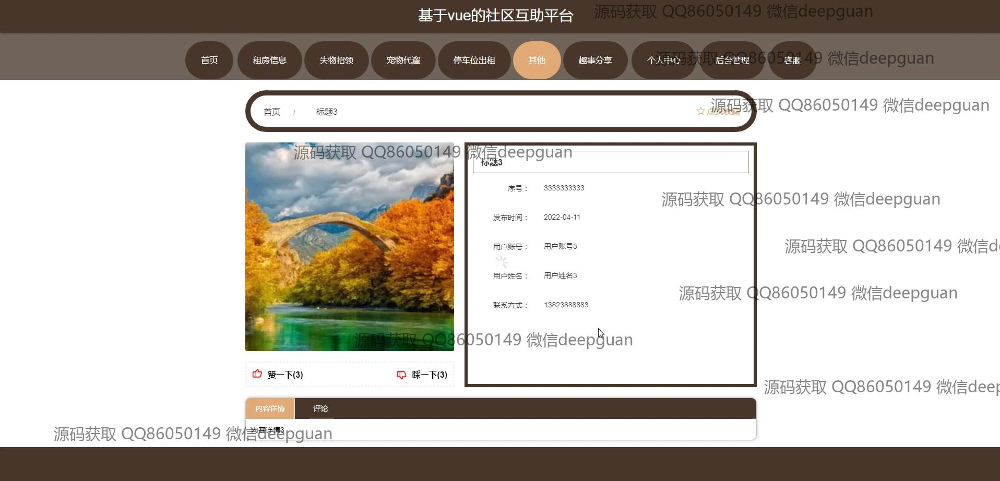
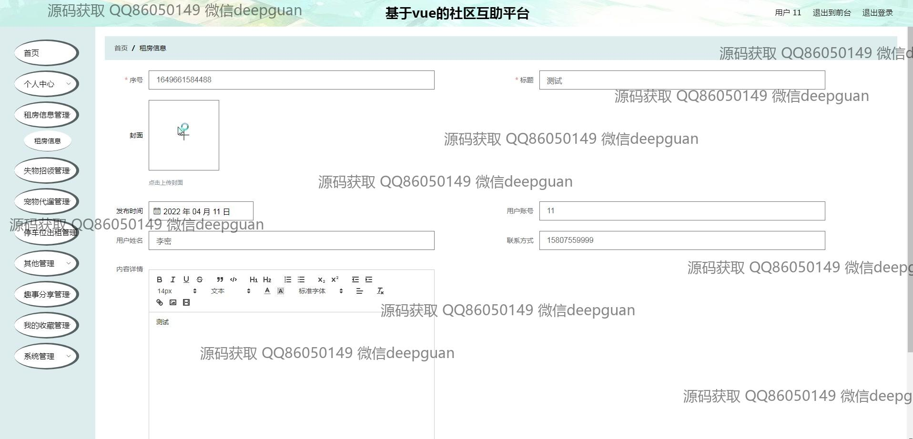

<h1 align="center">基于vue的社区互助平台</h1>

## 简介
社区互助平台：角色分为管理员、用户；功能包括租房信息管理、失物招领管理、宠物代管管理、停车位出租管理及用户信息管理，支持丰富的互动与资源共享功能。    --计算机毕业设计源码；毕设源码；java毕业设计源码

## 联系方式

<h3 align="center">获取完整代码与数据库文件 + 微信：deepguan QQ: 86050149 QQ群: 783742310</h3>

<h3 align="center">可帮忙远程部署 包运行成功！提供远程部署、修改代码、设计文档指导、代码讲解等服务！</h3>

## 功能介绍（完整见运行截图）
管理员：平台提供全面的功能模块，包括租房信息、失物招领、宠物代遛、停车位出租等管理。管理员可以进行导航配置、用户管理、内容发布审核、信息分类及权限设置。同时支持用户账号信息、评论反馈管理和系统维护，确保平台安全与稳定。

用户：用户可以注册并登录平台，访问主要功能模块如租房信息、失物招领、宠物代遛服务。用户能发布、编辑和管理个人信息及租售信息，例如填写联系方式、上传图片和编辑详细描述。平台还提供评论交流以及客服反馈渠道，促进用户之间的互动和互助。

## 运行截图

本代码来源于网络,仅供学习参考使用!

